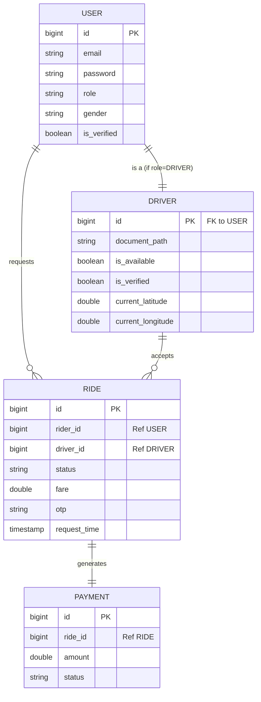
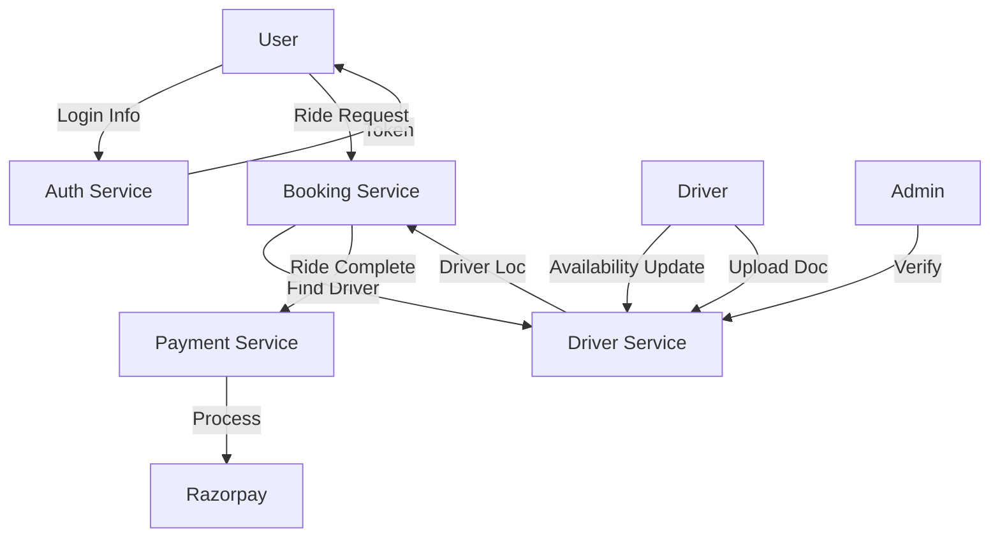
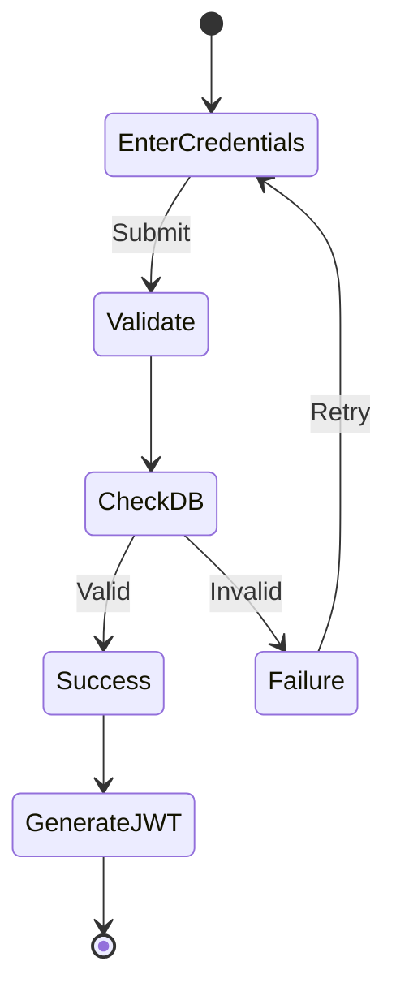
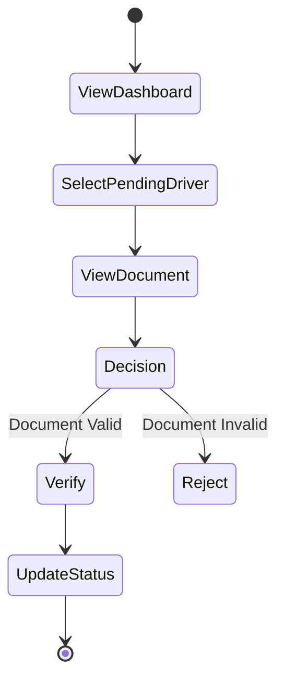
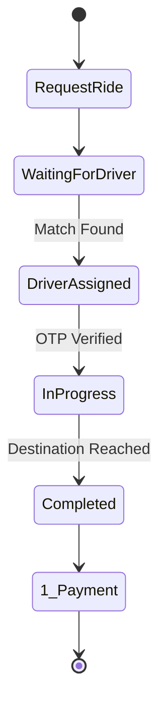
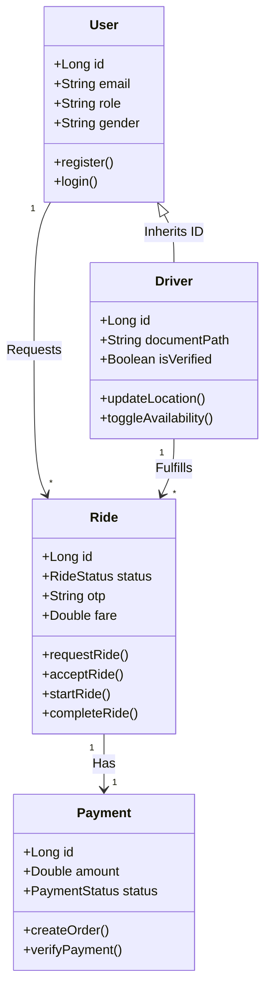
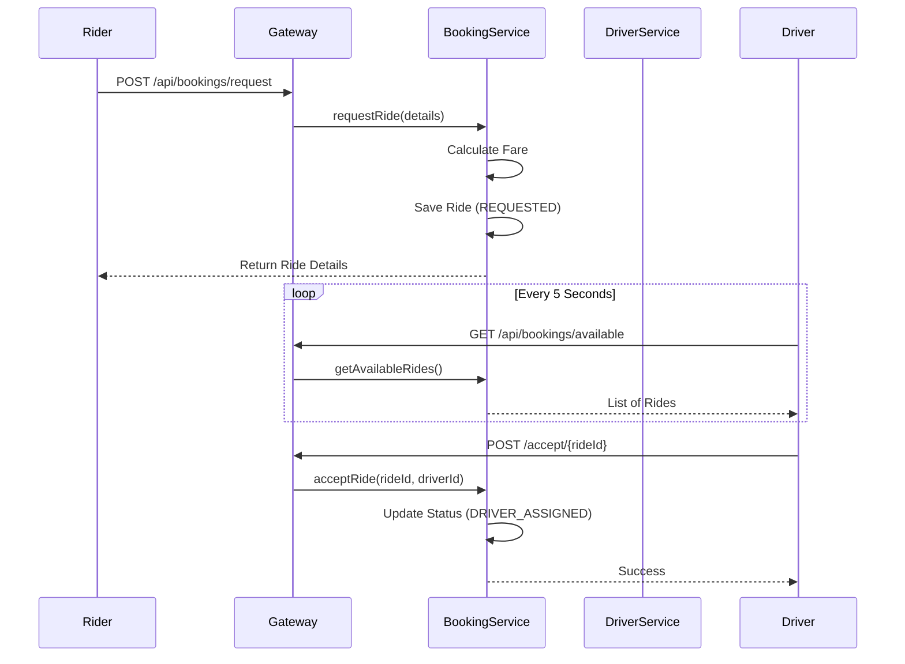

# HerWayCabs UML & Design Diagrams 📊

This document contains the structural and behavioral diagrams for the HerWayCabs system.
**Note**: You can view these diagrams directly in VS Code (using a Markdown Preview extension) or on GitHub. They are rendered as high-quality vector graphics.

## 1. Entity Relationship Diagram (ERD)
This diagram shows the logical data model across the microservices.



---

## 2. Use Case Diagram
High-level interactions between actors and the system.

```mermaid
usecaseDiagram
    actor Rider
    actor Driver
    actor Admin

    package HerWayCabs_System {
        usecase "Register/Login" as UC1
        usecase "Request Ride" as UC2
        usecase "View Ride History" as UC3
        usecase "Data Verification" as UC4
        usecase "Upload Documents" as UC5
        usecase "Go Online/Offline" as UC6
        usecase "Accept Ride" as UC7
        usecase "Verify Driver" as UC8
        usecase "Make Payment" as UC9
    }

    Rider --> UC1
    Rider --> UC2
    Rider --> UC3
    Rider --> UC9

    Driver --> UC1
    Driver --> UC3
    Driver --> UC5
    Driver --> UC6
    Driver --> UC7

    Admin --> UC4
    Admin --> UC8
```

---

## 3. Data Flow Diagram (DFD Level 0)
The Context Diagram showing the system as a single process.

```mermaid
graph LR
    User[Users (Rider/Driver)] -- "Credentials, Loc, Requests" --> System((HerWayCabs System))
    Admin -- "Verification Decisions" --> System
    System -- "Ride Status, Notifications" --> User
    System -- "Pending Verifications" --> Admin
    System -- "Payment Request" --> PaymentGateway[Razorpay]
    PaymentGateway -- "Payment Status" --> System
```

## 4. Data Flow Diagram (DFD Level 1)
Breakdown of the main system processes.



---

## 5. Activity Diagrams

### A. Login Flow


### B. Admin Verification Flow


### C. Ride Flow (User)


---

## 6. Class Diagram
Key classes and their relationships in the backend codes.



---

## 7. Component Diagram
Shows how the microservices are wired together.

```mermaid
graph TD
    Client[React Client] <--> Gateway[API Gateway :8080]
    Gateway <--> Registry[Eureka Server :8761]
    
    Gateway <--> Auth[Auth Service :8081]
    Gateway <--> Driver[Driver Service :8082]
    Gateway <--> Booking[Booking Service :8083]
    Gateway <--> Payment[Payment Service :8084]
    
    Gateway <--> Admin[Admin Portal (ASP.NET) :5000]
    
    Auth -.->|Syncs User| Driver
    Booking -.->|Queries| Driver
    Booking -.->|Triggers| Payment
```

---

## 8. Sequence Diagram (Ride Booking Flow)
The chronological sequence of a successful ride booking.



---

## 9. Deployment Diagram
How the application nodes are physically (or virtually) deployed.

```mermaid
graph TD
    subgraph Host Machine (Windows Laptop)
        subgraph Browser Environment
            Frontend[React App :5173]
        end
        
        subgraph Docker / Runtime Environment
            Gateway[API Gateway]
            Auth[Auth Service]
            Booking[Booking Service]
            Driver[Driver Service]
            Payment[Payment Service]
            Admin[Admin Portal]
            Registry[Eureka]
        end
        
        subgraph Database Layer
            PG[(PostgreSQL :5432)]
            Redis[(Redis :6379)]
        end
    end
    
    Frontend --> Gateway
    Admin --> Gateway
    Gateway --> Auth
    Gateway --> Booking
    Gateway --> Driver
    Gateway --> Payment
    
    Auth --> PG
    Booking --> PG
    Driver --> PG
    Payment --> PG
    
    Driver --> Redis
```
